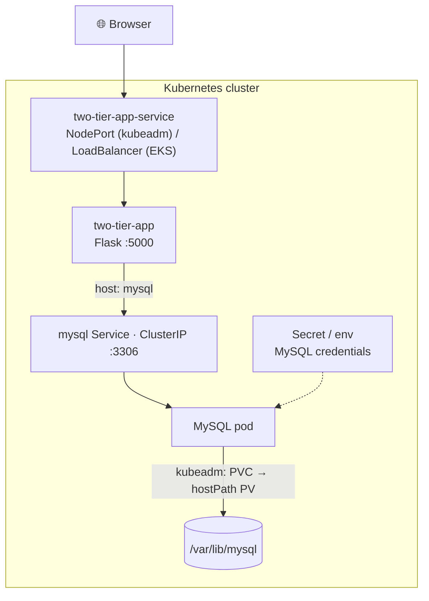

# Two-Tier Flask + MySQL App on Kubernetes

Deploying a **two-tier web application** — a **Python / Flask** app backed by a **MySQL** database — on Kubernetes, with manifests for **both** a self-managed **kubeadm** cluster (NodePort + hostPath storage) and **Amazon EKS** (cloud LoadBalancer + Secret/ConfigMap). Also containerized with Docker and wired into a Jenkins CI pipeline.

The Flask app stores and displays user-submitted messages; it finds the database through the `mysql` Service by name (service discovery), so it keeps working as pods are recreated.


---

## Architecture



| Tier | Component | kubeadm (`k8s/`) | EKS (`eks-manifests/`) |
|------|-----------|------------------|------------------------|
| Application | Flask app (`:5000`) | Service type **NodePort** (`30004`) | Service type **LoadBalancer** |
| Data | MySQL (`:3306`) | ClusterIP + hostPath **PV/PVC** | ClusterIP + **Secret** + init **ConfigMap** |

---

## Repository layout

```
.
├── app.py                     # Flask app (reads MySQL config from env vars)
├── templates/index.html       # the frontend page
├── message.sql                # creates the `messages` table
├── requirements.txt           # Python dependencies
├── Dockerfile                 # container build (+ Dockerfile-multistage variant)
├── docker-compose.yml         # local two-container run (app + MySQL)
├── Makefile                   # build / run / clean shortcuts around compose
├── Jenkinsfile                # CI: clone → Trivy scan → build → push → deploy
├── k8s/                       # ← kubeadm deployment (NodePort + hostPath PV)
│   ├── mysql-pv.yml / mysql-pvc.yml
│   ├── mysql-deployment.yml / mysql-svc.yml
│   ├── two-tier-app-deployment.yml / two-tier-app-svc.yml
│   └── two-tier-app-pod.yml   # (alternative: run the app as a bare Pod)
└── eks-manifests/             # ← Amazon EKS deployment (LoadBalancer + Secret)
    ├── mysql-secrets.yml / mysql-configmap.yml
    ├── mysql-deployment.yml / mysql-svc.yml
    └── two-tier-app-deployment.yml / two-tier-app-svc.yml
```

---

## Prerequisites

Before you begin, make sure you have the following installed:

- **Docker** (and the **Docker Compose** plugin — `docker compose version`)
- **Git** (optional, for cloning the repository)
- For the Kubernetes part: a cluster and **`kubectl`** — either build a self-managed
  one by following **Part 2** below, or use **Amazon EKS** (with the AWS CLI / `eksctl`)

---

# Part 1 — Flask App with MySQL Docker Setup

Run the whole two-tier app locally in containers, either with Docker Compose or with plain `docker run` commands.

## 1. Clone the repository

```bash
git clone https://github.com/nitin1094/two-tier-flask-app-k8s.git
cd two-tier-flask-app-k8s
```

## 2. Create a `.env` file

The Compose file runs MySQL as `user: "${UID}:${GID}"` so the bind-mounted data
directory isn't owned by root. Docker Compose reads these from a `.env` file in the
project directory, so create one:

```bash
touch .env
```

Add your user/group IDs to it:

```bash
# Linux / macOS — fill in the real values:
#   id -u   ->  UID
#   id -g   ->  GID
UID=1000
GID=1000
```

> On **Linux/macOS** you can generate it in one line:
> ```bash
> printf "UID=%s\nGID=%s\n" "$(id -u)" "$(id -g)" > .env
> ```
> On **Windows** (Docker Desktop) these IDs aren't meaningful — leave `UID=1000` /
> `GID=1000`. If MySQL then fails to start on the bind mount, delete the
> `user: "${UID}:${GID}"` line from `docker-compose.yml`.

## 3. Build the application image

The Compose file references the image **by name only** (it has no `build:` section),
so `docker compose up --build` will *not* build anything — build and tag it yourself first:

```bash
docker build -t nitin1094/two-tier-flask-app:latest .
```

<details>
<summary>Two image tags are used in this repo</summary>

| Consumer | Expected image |
|---|---|
| `docker-compose.yml` | `nitin1094/two-tier-flask-app:latest` |
| Kubernetes manifests (`k8s/`, `eks-manifests/`) | `nitin1094/flaskapp:latest` |

Tag one build for both so either path works:
```bash
docker build -t nitin1094/two-tier-flask-app:latest .
docker tag nitin1094/two-tier-flask-app:latest nitin1094/flaskapp:latest
```

There is also a smaller multi-stage build:
```bash
docker build -f Dockerfile-multistage -t nitin1094/two-tier-flask-app:slim .
```
</details>

## 4. Option A — Run with Docker Compose (recommended)

```bash
docker compose up -d          # start MySQL + the Flask app in the background
docker compose ps             # both containers should be "Up"
```

Compose creates a `twotier` network, starts `mysql:5.7` (database **`devops`**, root
password **`root`**), mounts `./mysql-data` for persistence, auto-loads `message.sql`
to create the `messages` table, then starts the Flask app on port **5000**.

**Access the app:** <http://localhost:5000>

Open it in your browser, type a message into the form, and submit — it's written to
MySQL and appears in the list on reload.

**Follow the logs:**

```bash
docker compose logs -f flask-app
docker compose logs -f mysql
```

**Stop / clean up:**

```bash
docker compose down           # stop and remove the containers + network
docker compose down -v        # ...and also remove named volumes
```

> The `./mysql-data` folder is a bind mount on your host, so your data survives
> `docker compose down`. Delete that folder to start from an empty database.

## 5. Option B — Run without Docker Compose

Useful for understanding what Compose does for you. Both containers must share a
network so they can reach each other by name.

**i) Create the network**

```bash
docker network create twotier
```

**ii) Start the MySQL container**

```bash
docker run -d \
    --name mysql \
    --network=twotier \
    -v mysql-data:/var/lib/mysql \
    -e MYSQL_DATABASE=mydb \
    -e MYSQL_ROOT_PASSWORD=admin \
    -p 3306:3306 \
    mysql:5.7
```

**iii) Start the Flask container**

```bash
docker run -d \
    --name flaskapp \
    --network=twotier \
    -e MYSQL_HOST=mysql \
    -e MYSQL_USER=root \
    -e MYSQL_PASSWORD=admin \
    -e MYSQL_DB=mydb \
    -p 5000:5000 \
    nitin1094/flaskapp:latest
```

`MYSQL_HOST=mysql` is the **container name** — Docker's embedded DNS resolves it on
the `twotier` network, which is the same idea as a Kubernetes Service name later on.

**iv) Verify**

```bash
docker ps                     # both containers running?
docker logs flaskapp          # look for "Connected to database."
```

Then open <http://localhost:5000>.

**v) Clean up**

```bash
docker rm -f flaskapp mysql
docker network rm twotier
docker volume rm mysql-data   # optional: delete the database data
```

## The `messages` table

The app stores messages in a single table:

```sql
CREATE TABLE messages (
    id INT AUTO_INCREMENT PRIMARY KEY,
    message TEXT
);
```

You normally **don't** need to create it by hand — it's created for you in two ways:

- **Compose:** `message.sql` is mounted into `/docker-entrypoint-initdb.d/`, so MySQL
  runs it the first time the database is initialised.
- **The app:** `init_db()` in `app.py` runs `CREATE TABLE IF NOT EXISTS` on startup.

If you ever need to create it manually (e.g. the plain-Docker path with a pre-existing
volume):

```bash
docker exec -it mysql mysql -uroot -padmin mydb \
  -e "CREATE TABLE IF NOT EXISTS messages (id INT AUTO_INCREMENT PRIMARY KEY, message TEXT);"
```

## Environment variables

`app.py` reads all database settings from the environment (defaults in brackets):

| Variable | Purpose | Default |
|---|---|---|
| `MYSQL_HOST` | Database hostname — a container name, Docker Compose service, or K8s Service | `localhost` |
| `MYSQL_USER` | MySQL user | `default_user` |
| `MYSQL_PASSWORD` | MySQL password | `default_password` |
| `MYSQL_DB` | Database name | `default_db` |

## Routes

| Method | Path | Description |
|---|---|---|
| `GET` | `/` | Renders `index.html` with all stored messages |
| `POST` | `/submit` | Saves a new message (form field `new_message`), returns JSON |

## Push the image to a registry

Needed before deploying to Kubernetes, since the cluster pulls the image:

```bash
docker login
docker push nitin1094/two-tier-flask-app:latest
docker push nitin1094/flaskapp:latest
```

## Troubleshooting

| Symptom | Fix |
|---|---|
| `docker compose up --build` doesn't rebuild the app | Expected — the service has no `build:` section. Run `docker build -t nitin1094/two-tier-flask-app:latest .` first (step 3). |
| Compose warns `The "UID" variable is not set` | Create the `.env` file from step 2. |
| MySQL container exits / permission denied on `./mysql-data` | The `user: "${UID}:${GID}"` mapping doesn't match the folder owner. Fix the IDs in `.env`, `rm -rf ./mysql-data`, or remove the `user:` line. |
| `flask-app` shows **(unhealthy)** but the site works | The Compose health-check curls `/health`, which this app doesn't implement. Harmless — ignore it, or add a `/health` route to `app.py`. |
| App logs `Could not connect to database.` | MySQL wasn't ready yet (it can take ~30–60s on first run) or the credentials don't match. Check `docker compose logs mysql` and that `MYSQL_USER`/`MYSQL_PASSWORD`/`MYSQL_DB` line up. |
| Port already in use | Something else is on 5000/3306 — change the left-hand side of the port mapping. |

---

# Part 2 — Set up a self-managed cluster with kubeadm

No cluster yet? These steps build a **two-node Kubernetes v1.29 cluster** (1 master + 1 worker)
from plain Ubuntu servers using `kubeadm`, with **containerd** as the container runtime and
**Calico** as the pod network. Already have a cluster (or using EKS)? Skip to Part 3.

## Prerequisites

- **Ubuntu** OS (Xenial or later)
- `sudo` privileges
- Internet access
- **t2.medium** instance type or higher (2 vCPU / 4 GB RAM minimum)

## AWS setup

1. Ensure that all instances are in the **same Security Group**.
2. Expose port **6443** in the Security Group to allow worker nodes to join the cluster.
3. Expose port **22** in the Security Group to allow SSH access to manage the instances.

<details>
<summary><b>Step-by-step: create the Security Group in the AWS Console</b></summary>

### Step 1: Identify or create a Security Group

1. **Log in to the AWS Management Console** and open the **EC2 Dashboard**.
2. **Locate Security Groups** — in the left menu under **Network & Security**, click **Security Groups**.
3. **Create a new Security Group** — click **Create security group** and provide:
   - **Name**: e.g. `Kubernetes-Cluster-SG`
   - **Description**: a brief description (mandatory)
   - **VPC**: select the VPC for your instances (the default is acceptable)
4. **Add inbound rules**:

   | Purpose | Type | Port range | Source |
   |---|---|---|---|
   | SSH access | SSH | `22` | `0.0.0.0/0` (anywhere) or your specific IP |
   | Kubernetes API | Custom TCP | `6443` | `0.0.0.0/0` (anywhere) or specific IP ranges |

5. **Save the rules** — click **Create security group**.

### Step 2: Select the Security Group when creating instances

When launching your EC2 instances, under **Configure Security Group**, select the existing
group (`Kubernetes-Cluster-SG`).

> **Note:** Security group settings can be updated later as needed.

</details>

---

## Execute on BOTH the "Master" and "Worker" nodes

**1. Disable swap** — required for Kubernetes to function correctly.

```bash
sudo swapoff -a
```

**2. Load the necessary kernel modules** — required for Kubernetes networking.

```bash
cat <<EOF | sudo tee /etc/modules-load.d/k8s.conf
overlay
br_netfilter
EOF

sudo modprobe overlay
sudo modprobe br_netfilter
```

**3. Set sysctl parameters** — lets bridged traffic reach iptables and enables IP forwarding.

```bash
cat <<EOF | sudo tee /etc/sysctl.d/k8s.conf
net.bridge.bridge-nf-call-iptables  = 1
net.bridge.bridge-nf-call-ip6tables = 1
net.ipv4.ip_forward                 = 1
EOF

sudo sysctl --system

# verify the modules are loaded
lsmod | grep br_netfilter
lsmod | grep overlay
```

**4. Install containerd** — the container runtime Kubernetes will use.

```bash
sudo apt-get update
sudo apt-get install -y ca-certificates curl
sudo install -m 0755 -d /etc/apt/keyrings
sudo curl -fsSL https://download.docker.com/linux/ubuntu/gpg -o /etc/apt/keyrings/docker.asc
sudo chmod a+r /etc/apt/keyrings/docker.asc

echo "deb [arch=$(dpkg --print-architecture) signed-by=/etc/apt/keyrings/docker.asc] https://download.docker.com/linux/ubuntu $(. /etc/os-release && echo "$VERSION_CODENAME") stable" | sudo tee /etc/apt/sources.list.d/docker.list > /dev/null

sudo apt-get update
sudo apt-get install -y containerd.io

# use the systemd cgroup driver (required by the kubelet) and a current pause image
containerd config default | sed -e 's/SystemdCgroup = false/SystemdCgroup = true/' -e 's/sandbox_image = "registry.k8s.io\/pause:3.6"/sandbox_image = "registry.k8s.io\/pause:3.9"/' | sudo tee /etc/containerd/config.toml

sudo systemctl restart containerd
sudo systemctl status containerd
```

**5. Install the Kubernetes components** — `kubelet`, `kubeadm` and `kubectl` (v1.29).

```bash
sudo apt-get update
sudo apt-get install -y apt-transport-https ca-certificates curl gpg

curl -fsSL https://pkgs.k8s.io/core:/stable:/v1.29/deb/Release.key | sudo gpg --dearmor -o /etc/apt/keyrings/kubernetes-apt-keyring.gpg

echo 'deb [signed-by=/etc/apt/keyrings/kubernetes-apt-keyring.gpg] https://pkgs.k8s.io/core:/stable:/v1.29/deb/ /' | sudo tee /etc/apt/sources.list.d/kubernetes.list

sudo apt-get update
sudo apt-get install -y kubelet kubeadm kubectl

# pin the versions so an apt upgrade can't break the cluster
sudo apt-mark hold kubelet kubeadm kubectl
```

> **Everything above must run on every node**, and the versions must match. A
> kubelet/kubeadm version mismatch between master and worker is a common cause of a
> failed `kubeadm join`.

---

## Execute ONLY on the "Master" node

**1. Initialize the cluster** — bootstraps the control plane.

```bash
sudo kubeadm init
```

**2. Set up your local kubeconfig** so `kubectl` can talk to the cluster.

```bash
mkdir -p "$HOME"/.kube
sudo cp -i /etc/kubernetes/admin.conf "$HOME"/.kube/config
sudo chown "$(id -u)":"$(id -g)" "$HOME"/.kube/config
```

**3. Install a network plugin (Calico)** — until a CNI is installed, nodes stay `NotReady`.

```bash
kubectl apply -f https://raw.githubusercontent.com/projectcalico/calico/v3.26.0/manifests/calico.yaml
```

**4. Generate the join command** for your worker nodes.

```bash
kubeadm token create --print-join-command
```

> Copy the printed `kubeadm join ...` command — you need it on every worker node.

---

## Execute on ALL of your "Worker" nodes

**1. Reset any previous cluster state** (only needed if the node was joined before):

```bash
sudo kubeadm reset -f
```

**2. Paste the join command** you copied from the master, adding `sudo` at the front and
`--v=5` at the end for verbose output:

```bash
sudo kubeadm join <private-ip-of-control-plane>:6443 \
  --token <token> \
  --discovery-token-ca-cert-hash sha256:<hash> \
  --cri-socket "unix:///run/containerd/containerd.sock" \
  --v=5
```

In other words:

```bash
sudo <paste-join-command-here> --v=5
```

A successful join ends with **"This node has joined the cluster."**

---

## Verify the cluster

On the **master** node:

```bash
kubectl get nodes
```

Both nodes should report `STATUS: Ready` and `VERSION: v1.29.x` — one with the
`control-plane` role and one with `<none>` (the worker):

```
NAME           STATUS   ROLES           AGE   VERSION
master-node    Ready    control-plane   5m    v1.29.0
worker-node    Ready    <none>          2m    v1.29.0
```

Check that the system pods (including Calico) are running:

```bash
kubectl get pods -n kube-system
```

### Troubleshooting the cluster build

| Symptom | Likely cause / fix |
|---|---|
| `kubeadm join` hangs or times out | Port **6443** isn't open between the nodes in the Security Group. `--v=5` shows exactly where it stalls. |
| Nodes stuck in `NotReady` | No CNI installed yet — apply the Calico manifest on the master. |
| kubelet won't start | Swap is still on (`sudo swapoff -a`), or containerd isn't using the `systemd` cgroup driver (step 4). |
| `kubeadm join` fails with a cert/token error | Tokens expire after 24h — generate a fresh one on the master with `kubeadm token create --print-join-command`. |

With the cluster `Ready`, continue to Part 3 to deploy the app onto it.

---

# Part 3 — Deploy on Kubernetes

> **Before you start:** have a cluster ready (Part 2, or EKS), build and push the app image
> (steps 3 and *Push the image* above), and make sure the `image:` field in the
> `two-tier-app` manifests points at it.

## On a kubeadm cluster

```bash
cd k8s
kubectl apply -f mysql-pv.yml -f mysql-pvc.yml                          # storage
kubectl apply -f mysql-deployment.yml -f mysql-svc.yml                  # database
kubectl apply -f two-tier-app-deployment.yml -f two-tier-app-svc.yml    # app
kubectl get pods,svc
# open http://<worker-node-ip>:30004/
```

See [`k8s/README.md`](k8s/README.md) for the detailed walkthrough.

## On Amazon EKS

```bash
cd eks-manifests
kubectl apply -f mysql-configmap.yml -f mysql-secrets.yml
kubectl apply -f mysql-deployment.yml -f mysql-svc.yml
kubectl apply -f two-tier-app-deployment.yml -f two-tier-app-svc.yml
kubectl get svc two-tier-app-service   # wait for the LoadBalancer EXTERNAL-IP, then open it
```

---

## What this project demonstrates

- **Containerizing** a Python/Flask + MySQL app (single-stage and multi-stage Dockerfiles)
- Running a multi-container app with **Docker Compose** and with plain Docker networking
- **Two-tier deployment** on Kubernetes: Deployments, Services, and cross-tier **service discovery** by Service name
- Two exposure models: **NodePort** on a self-managed cluster vs a cloud **LoadBalancer** on EKS
- **Persistent storage** (PV/PVC, hostPath) so the database survives pod restarts
- Managing configuration with **Secrets** and **ConfigMaps** (EKS variant)
- **CI** with Jenkins: source scan (Trivy) → build → push to a registry → deploy

---

## Security note

The manifests and Compose file ship with **demo database credentials** so the project
runs out of the box. They are throwaway values — replace them with your own before any
real use. Kubernetes Secrets are only base64-encoded (not encrypted), so never commit
real credentials; use a sealed-secrets tool or an external secrets manager in production.

Also note the app interpolates form input via parameterised queries — keep it that way,
and validate/sanitise any new inputs to avoid SQL injection.
