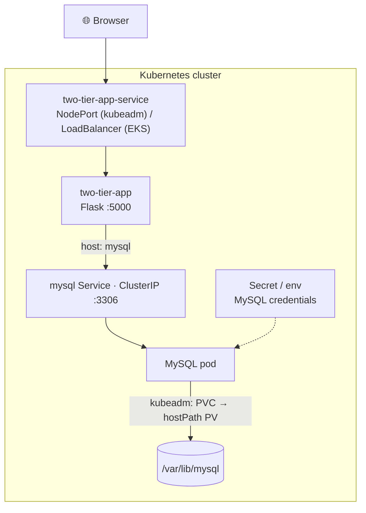

# Two-Tier Flask + MySQL App on Kubernetes

Deploying a **two-tier web application** — a **Python / Flask** app backed by a **MySQL** database — on Kubernetes, with manifests for **both** a self-managed **kubeadm** cluster (NodePort + hostPath storage) and **Amazon EKS** (cloud LoadBalancer + Secret/ConfigMap). Also containerized with Docker and wired into a Jenkins CI pipeline.

The Flask app stores and displays user-submitted messages; it finds the database through the `mysql` Service by name (service discovery), so it keeps working as pods are recreated.


---

## Architecture



| Tier | Component | kubeadm (`k8s/`) | EKS (`eks-manifests/`) |
|------|-----------|------------------|------------------------|
| Application | Flask app (`:5000`) | Service type **NodePort** (`30004`) | Service type **LoadBalancer** |
| Data | MySQL (`:3306`) | ClusterIP + hostPath **PV/PVC** | ClusterIP + **Secret** + init **ConfigMap** |

---

## Repository layout

```
.
├── app.py                     # Flask app (reads MySQL config from env vars)
├── templates/index.html       # the frontend page
├── requirements.txt           # Python dependencies
├── Dockerfile                 # container build (+ Dockerfile-multistage variant)
├── docker-compose.yml         # local two-container run (app + MySQL)
├── Makefile                   # build / run / clean shortcuts around compose
├── Jenkinsfile                # CI: clone → Trivy scan → build → push → deploy
├── k8s/                       # ← kubeadm deployment (NodePort + hostPath PV)
│   ├── mysql-pv.yml / mysql-pvc.yml
│   ├── mysql-deployment.yml / mysql-svc.yml
│   ├── two-tier-app-deployment.yml / two-tier-app-svc.yml
│   └── two-tier-app-pod.yml   # (alternative: run the app as a bare Pod)
└── eks-manifests/             # ← Amazon EKS deployment (LoadBalancer + Secret)
    ├── mysql-secrets.yml / mysql-configmap.yml
    ├── mysql-deployment.yml / mysql-svc.yml
    └── two-tier-app-deployment.yml / two-tier-app-svc.yml
```

> **Before deploying:** build the app image, push it to your registry, and set the
> `image:` field in the `two-tier-app` deployment(s) to `nitin1094/...`.

---

## Run it

### Local (Docker Compose)
```bash
docker-compose up --build      # app on http://localhost:5000, MySQL alongside
```

### On a kubeadm cluster
```bash
cd k8s
kubectl apply -f mysql-pv.yml -f mysql-pvc.yml       # storage
kubectl apply -f mysql-deployment.yml -f mysql-svc.yml   # database
kubectl apply -f two-tier-app-deployment.yml -f two-tier-app-svc.yml   # app
kubectl get pods,svc
# open http://<worker-node-ip>:30004/
```

### On Amazon EKS
```bash
cd eks-manifests
kubectl apply -f mysql-configmap.yml -f mysql-secrets.yml
kubectl apply -f mysql-deployment.yml -f mysql-svc.yml
kubectl apply -f two-tier-app-deployment.yml -f two-tier-app-svc.yml
kubectl get svc two-tier-app-service   # wait for the LoadBalancer EXTERNAL-IP, then open it
```

---

## What this project demonstrates

- **Containerizing** a Python/Flask + MySQL app (single-stage and multi-stage Dockerfiles)
- **Two-tier deployment** on Kubernetes: Deployments, Services, and cross-tier **service discovery** by Service name
- Two exposure models: **NodePort** on a self-managed cluster vs a cloud **LoadBalancer** on EKS
- **Persistent storage** (PV/PVC, hostPath) so the database survives pod restarts
- Managing configuration with **Secrets** and **ConfigMaps** (EKS variant)
- **CI** with Jenkins: source scan (Trivy) → build → push to a registry → deploy

---

## Security note

The manifests and compose file ship with **demo database credentials** so the project
runs out of the box. They are throwaway values — replace them with your own before any
real use. Kubernetes Secrets are only base64-encoded (not encrypted), so never commit
real credentials; use a sealed-secrets tool or an external secrets manager in production.
